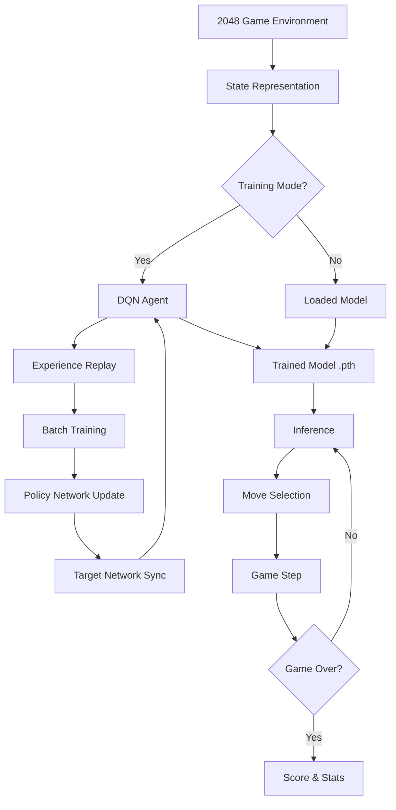

# 2048 AI Solver

[](https://python.org)
[](https://pytorch.org)
[](https://stable-baselines3.readthedocs.io)
[](https://optuna.org)
[](LICENSE)

Deep Reinforcement Learning агент для игры 2048. Реализация **Deep Q-Network (DQN)** с нуля на PyTorch, бейзлайн на **Stable-Baselines3** и оптимизация гиперпараметров через **Optuna**.

## Архитектура



## Возможности

- **Собственная реализация DQN** — Experience replay, target network, epsilon-greedy exploration
- **Stable-Baselines3 baseline** — PPO/DQN агенты для сравнения
- **Optuna hyperparameter tuning** — Автоматический поиск learning rate, batch size, архитектуры сети
- **Pygame GUI** — Визуальный интерфейс с анимациями, счётом и режимом AI
- **Несколько скриптов обучения** — `train_agent.py` (кастомный DQN), `train_sb3.py` (SB3), `train_dqn.py` (облегчённый DQN)
- **Метрики** — Графики обучения, награды, гистограммы максимальных плиток

## Структура проекта

```
2048_AI_solver/
├── game.py                  # Логика игры 2048 (board, moves, scoring)
├── game_env.py              # Gymnasium environment wrapper
├── ai_solver.py             # DQN нейросеть и агент
├── train_agent.py           # Обучение кастомного DQN
├── train_sb3.py             # Обучение Stable-Baselines3
├── train_dqn.py             # Облегчённый DQN
├── tune_sb3_optuna.py       # Optuna hyperparameter tuning
├── main.py                  # Точка входа: GUI или CLI
├── main_gui.py              # Pygame GUI рендерер
├── custom_extractor.py      # Кастомный feature extractor для SB3
├── generate_hard_positions.py  # Генератор сложных позиций
├── export.py                # Экспорт моделей
├── models_pytorch/          # Сохранённые модели (.pth)
├── requirements.txt
└── README.md
```

## Установка

```bash
git clone https://github.com/HolSoul/2048_AI_solver.git
cd 2048_AI_solver

python -m venv .venv
.venv\Scripts\activate  # Windows
source .venv/bin/activate  # macOS/Linux

pip install -r requirements.txt
```

Для PyTorch с CUDA — [официальная инструкция](https://pytorch.org/get-started/locally/).

## Использование

### Запуск с GUI (человек или AI)

```bash
python main.py
```

Управление:
- **Стрелки** — ручной режим
- **R** — сброс игры
- **Q** — выход
- **M** — переключение AI (используется модель из `models_pytorch/`)

### Обучение DQN агента

```bash
python train_agent.py
```

Настройка параметров внутри скрипта (`NUM_EPISODES`, `MAX_STEPS_PER_EPISODE`, `learning_rate` и т.д.).

### Обучение Stable-Baselines3

```bash
python train_sb3.py
```

### Hyperparameter Tuning

```bash
python tune_sb3_optuna.py
```

## Детали обучения

### Представление состояния (State Representation)
- Доска 4×4 → развёрнутый вектор из 16 элементов
- Логарифмическое кодирование: `log2(значение плитки)` (пусто = 0)

### Reward Function
- **Положительная**: слияние плиток (+значение новой плитки)
- **Отрицательная**: штраф за уменьшение пустых клеток
- **Бонус**: достижение новой максимальной плитки
- **Терминальная**: штраф за game over

### Гиперпараметры (кастомный DQN)

| Параметр | Значение |
|----------|----------|
| Learning Rate | 1e-4 (Adam) |
| Batch Size | 64 |
| Replay Buffer | 100,000 |
| Gamma (discount) | 0.99 |
| Epsilon Decay | 0.995 |
| Target Network Sync | Каждые 1000 шагов |

## Результаты

DQN агент стабильно достигает плиток **1024+**, иногда **2048** после ~1000+ эпизодов обучения. Графики сохраняются в `training_history_pytorch.png`.

## Tech Stack

- **Framework**: PyTorch
- **RL Libraries**: Stable-Baselines3, Gymnasium
- **Optimization**: Optuna
- **Visualization**: Matplotlib, Pygame
- **Python**: 3.8+

## Лицензия

MIT License — см. [LICENSE](LICENSE)
